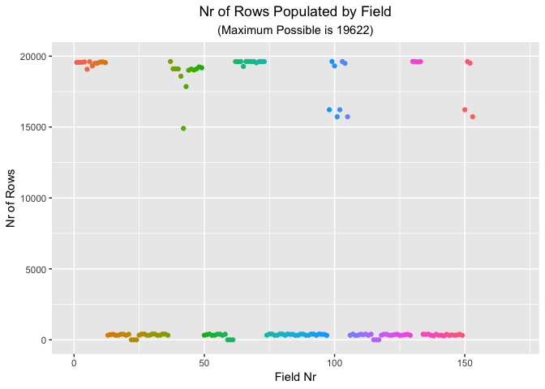

# **Overview**
This report describes the design and build of a predictive model based on some very detailed and granular data made available on the following web site - http://groupware.les.inf.puc-rio.br/har. The original dataset records sample exercise activity of a group of enthusiasts who take measurements about themselves regularly to improve their health, to find patterns in their behaviour, or because they are tech geeks. 

One thing that people regularly do is quantify how much of a particular activity they do, but they rarely quantify how well they do it. The activity here is a dumbell biceps curl. Given a fresh subset of values for the 159 predictors available, the model is designed to predict where that subset or testing dataset fits in terms of the 5 classes that indicate how well the curl was done, namely 

* A - exactly according to the specification 
* B - throwing the elbows to the front 
* C - lifting the dumbbell only halfway
* D - lowering the dumbbell only halfway
* E - throwing the hips to the front

As such, it is clear that this is a classification requirement where the outcome of the model is one of the 5 classes above, rather than a number or a binary outcome e.g Yes or No, True or False.

The Groupware Archive has kindly published the report from the original study into the exercise activity data. The report is entitled "Qualitative Activity Recognition of Weight Lifting Exercises" and is very focused on qualitative assessment and mistake detection for a given exercise. The report is not focused on the study participants in terms of assessing who might have done an exercise better than others. So the assumption is made here that the first 7 data items in the training dataset should not be included in any model as they are effectively circumstantial rather than statistical evidence. These data items are

* X (a technical id, but sometimes preserved to help with data joins etc)
* user_name (which of the 6 participants performed the activity)
* raw_timestamp_part_1
* raw_timestamp_part_2
* cvtd_timestamp
* new_window (refers to the instrumentation used to measure the activities)
* num_window (refers to the instrumentation used to measure the activities)


## **Part 1 - Building the Model**

### ***1.1  Training Dataset Characteristics***
The original training dataset comprises 19,622 rows and 160 variables, one of which is the outcome field (classe) whilst the others can be considered predictors. The number of predictor variables reduces to 152 once the outcome field and the 7 circumstantial fields above are removed.  There is a marked characteristic of these predictors which has a bearing on the choice and effectiveness of prediction method (aka algorithm).

This characteristic is illustrated in the chart below, which shows that there are two broad groups of variables, one where the variables hold values in most of the 19,622 rows, the other where the variables hold values for less than 5% of the total rows. The former appear as the dots towards the top of the chart, the latter as the dots close to 0 on the y-axis.

There are 53 variables which are fully populated or close to it. There are 100 variables which hold less than 500 values in all and so can only be weak predictors of the outcome.





### ***1.2  Transforming the Original Data***
Even before an informed decision can be made on a suitable prediction method to use, care has to be taken when reading the original csv data into an R dataset. The parameter "stringsAsFactors = FALSE" should be used otherwise R will convert to factors any fields it considers to be strings in the original csv.

In the case of the weak predictor fields, the missing values will then be treated as NA's. The result of this is at best that a prediction method will return multiple warning messages and an inaccurate model, at worst that it will not run at all.

The parameter above ensures that any string fields in the original csv are treated as character fields rather than factors in R and so any missing values do not automatically create NA's. This still leaves the question of what to do with those missing values in the character fields created for them in R, given that nearly all of the populated string fields in the csv actually hold numbers.

The character fields in R must first be converted to numerics, which then allows the missing values to be treated as zeroes. Prediction methods may again raise warning messages when they see large numbers of zero values but they are much less likely to fail than if they see large numbers of NA's and some of them also offer intelligent ways of dealing with significant numbers of weak predictors.

Another possible approach here might have been to impute the missing values, but given that the percentage of missing values for 100 of the 160 variables was over 95%, this approach appeared more likely to distort or even drown the signal in the orignal data and so was not used.


## **Part 2 - Cross-Validation**

### ***2.1  Set up and check new training and validation datasets***
If the use case for the exercise activity data is primarily to help coach the enthusiasts when they do an exercise incorrectly, then the prediction model will deliver more value when the outcome class is not A. In those situations where the outcome class is A, then the prediction is that the enthusiast will do the exercise perfectly and little or no coaching is necessary.

It seems reasonable then to work with a training dataset where there are equal proportions of all the outcome classes. As shown in the table below, this is not the case with the original training dataset, which is imbalanced towards A to the tune of 28%, whilst the other classes vary between 16% and 19.5%. 

So, before using the original training dataset to generate new training and validation datasets, we will first resample - or more accurately - down-sample it to return equal proportions of all the outcome classes. The table as a whole then shows the results of pre-processing the original training dataset to set up new training and validation datasets with equal proportions of the outcome classe.


<table class="table table-striped" style="margin-left: auto; margin-right: auto;">
 <thead>
<tr>
<th style="border-bottom:hidden; padding-bottom:0; padding-left:3px;padding-right:3px;text-align: center; " colspan="1"><div style="border-bottom: 1px solid #ddd; padding-bottom: 5px; ">classe</div></th>
<th style="border-bottom:hidden; padding-bottom:0; padding-left:3px;padding-right:3px;text-align: center; " colspan="2"><div style="border-bottom: 1px solid #ddd; padding-bottom: 5px; ">Original Training</div></th>
<th style="border-bottom:hidden; padding-bottom:0; padding-left:3px;padding-right:3px;text-align: center; " colspan="2"><div style="border-bottom: 1px solid #ddd; padding-bottom: 5px; ">Down-sampled Training</div></th>
<th style="border-bottom:hidden; padding-bottom:0; padding-left:3px;padding-right:3px;text-align: center; " colspan="2"><div style="border-bottom: 1px solid #ddd; padding-bottom: 5px; ">New Training</div></th>
<th style="border-bottom:hidden; padding-bottom:0; padding-left:3px;padding-right:3px;text-align: center; " colspan="2"><div style="border-bottom: 1px solid #ddd; padding-bottom: 5px; ">Validation</div></th>
</tr>
  <tr>
   <th style="text-align:left;">   </th>
   <th style="text-align:right;"> Rows </th>
   <th style="text-align:right;"> Percentage </th>
   <th style="text-align:right;"> Rows </th>
   <th style="text-align:right;"> Percentage </th>
   <th style="text-align:right;"> Rows </th>
   <th style="text-align:right;"> Percentage </th>
   <th style="text-align:right;"> Rows </th>
   <th style="text-align:right;"> Percentage </th>
  </tr>
 </thead>
<tbody>
  <tr>
   <td style="text-align:left;"> A </td>
   <td style="text-align:right;"> 5580 </td>
   <td style="text-align:right;"> 28.43747 </td>
   <td style="text-align:right;"> 3216 </td>
   <td style="text-align:right;"> 20 </td>
   <td style="text-align:right;"> 2412 </td>
   <td style="text-align:right;"> 20 </td>
   <td style="text-align:right;"> 804 </td>
   <td style="text-align:right;"> 20 </td>
  </tr>
  <tr>
   <td style="text-align:left;"> B </td>
   <td style="text-align:right;"> 3797 </td>
   <td style="text-align:right;"> 19.35073 </td>
   <td style="text-align:right;"> 3216 </td>
   <td style="text-align:right;"> 20 </td>
   <td style="text-align:right;"> 2412 </td>
   <td style="text-align:right;"> 20 </td>
   <td style="text-align:right;"> 804 </td>
   <td style="text-align:right;"> 20 </td>
  </tr>
  <tr>
   <td style="text-align:left;"> C </td>
   <td style="text-align:right;"> 3422 </td>
   <td style="text-align:right;"> 17.43961 </td>
   <td style="text-align:right;"> 3216 </td>
   <td style="text-align:right;"> 20 </td>
   <td style="text-align:right;"> 2412 </td>
   <td style="text-align:right;"> 20 </td>
   <td style="text-align:right;"> 804 </td>
   <td style="text-align:right;"> 20 </td>
  </tr>
  <tr>
   <td style="text-align:left;"> D </td>
   <td style="text-align:right;"> 3216 </td>
   <td style="text-align:right;"> 16.38977 </td>
   <td style="text-align:right;"> 3216 </td>
   <td style="text-align:right;"> 20 </td>
   <td style="text-align:right;"> 2412 </td>
   <td style="text-align:right;"> 20 </td>
   <td style="text-align:right;"> 804 </td>
   <td style="text-align:right;"> 20 </td>
  </tr>
  <tr>
   <td style="text-align:left;"> E </td>
   <td style="text-align:right;"> 3607 </td>
   <td style="text-align:right;"> 18.38243 </td>
   <td style="text-align:right;"> 3216 </td>
   <td style="text-align:right;"> 20 </td>
   <td style="text-align:right;"> 2412 </td>
   <td style="text-align:right;"> 20 </td>
   <td style="text-align:right;"> 804 </td>
   <td style="text-align:right;"> 20 </td>
  </tr>
</tbody>
</table>


### ***2.2  Prediction Methods Tested***
Four prediction methods with classification capability were tested as a first-pass investigation into the best model to use. Key figures and confusion tables for all of these are shown below.

Both Decision Trees and Naive Bayes delivered suspect prediction accuracies -  less than 0.5 for the former and NaN for the latter. It appears that both methods were not suited to the missing values and weakness of many of the predictors in the dataset. The levels of confusion for these two are reflected in the numbers that appear outside the top left to bottom right diagonal in their confusion matrices.

The other two prediction methods tested were Random Forest and Boosting. The former returned an accuracy of 0.9884562 and the latter 0.9551734, as well as the very symmetrical confusion matrices below. These may be an indication of over-fitting.

How both models were cross-validated, tuned and tested for over-fitting is covered in the next sections. Also, the decision was made to proceed with the dedicated R packages for Random Forest and Generalized Boosting as the train functions in these ran significantly quicker than those in the Caret package and provided slightly more options for tuning.


##### First-Pass Model Key Figures and Confusion Matrices (run via caret package) #####

<table class="table table-striped" style="margin-left: auto; margin-right: auto;">
<tbody>
  <tr>
   <td style="text-align:center;"> Decision Trees </td>
   <td style="text-align:left;"> Accuracy: </td>
   <td style="text-align:center;"> 0.46 </td>
   <td style="text-align:center;"> Run Time: </td>
   <td style="text-align:left;"> 0.39 </td>
   <td style="text-align:center;"> mins </td>
  </tr>
  <tr>
   <td style="text-align:center;"> Naive Bayes </td>
   <td style="text-align:left;"> Accuracy: </td>
   <td style="text-align:center;"> NaN </td>
   <td style="text-align:center;"> Run Time: </td>
   <td style="text-align:left;"> 33.19 </td>
   <td style="text-align:center;"> mins </td>
  </tr>
  <tr>
   <td style="text-align:center;"> Random Forest </td>
   <td style="text-align:left;"> Accuracy: </td>
   <td style="text-align:center;"> 0.99 </td>
   <td style="text-align:center;"> Run Time: </td>
   <td style="text-align:left;"> 127 </td>
   <td style="text-align:center;"> mins </td>
  </tr>
  <tr>
   <td style="text-align:center;"> Boosting </td>
   <td style="text-align:left;"> Accuracy: </td>
   <td style="text-align:center;"> 0.96 </td>
   <td style="text-align:center;"> Run Time: </td>
   <td style="text-align:left;"> 35.49 </td>
   <td style="text-align:center;"> mins </td>
  </tr>
</tbody>
</table>

<center><table><tr valign="top"><td><table class="table table-striped" style="width: auto !important; margin-left: auto; margin-right: auto;">
<caption>Decision Trees</caption>
 <thead>
  <tr>
   <th style="text-align:left;">   </th>
   <th style="text-align:center;"> A </th>
   <th style="text-align:left;"> B </th>
   <th style="text-align:center;"> C </th>
   <th style="text-align:center;"> D </th>
   <th style="text-align:left;"> E </th>
  </tr>
 </thead>
<tbody>
  <tr>
   <td style="text-align:left;"> A </td>
   <td style="text-align:center;"> 231 </td>
   <td style="text-align:left;"> 9 </td>
   <td style="text-align:center;"> 0 </td>
   <td style="text-align:center;"> 0 </td>
   <td style="text-align:left;"> 0 </td>
  </tr>
  <tr>
   <td style="text-align:left;"> B </td>
   <td style="text-align:center;"> 15 </td>
   <td style="text-align:left;"> 269 </td>
   <td style="text-align:center;"> 28 </td>
   <td style="text-align:center;"> 151 </td>
   <td style="text-align:left;"> 103 </td>
  </tr>
  <tr>
   <td style="text-align:left;"> C </td>
   <td style="text-align:center;"> 545 </td>
   <td style="text-align:left;"> 526 </td>
   <td style="text-align:center;"> 776 </td>
   <td style="text-align:center;"> 653 </td>
   <td style="text-align:left;"> 327 </td>
  </tr>
  <tr>
   <td style="text-align:left;"> D </td>
   <td style="text-align:center;"> 0 </td>
   <td style="text-align:left;"> 0 </td>
   <td style="text-align:center;"> 0 </td>
   <td style="text-align:center;"> 0 </td>
   <td style="text-align:left;"> 0 </td>
  </tr>
  <tr>
   <td style="text-align:left;"> E </td>
   <td style="text-align:center;"> 13 </td>
   <td style="text-align:left;"> 0 </td>
   <td style="text-align:center;"> 0 </td>
   <td style="text-align:center;"> 0 </td>
   <td style="text-align:left;"> 374 </td>
  </tr>
</tbody>
</table></td><td>"     "</td><td><table class="table table-striped" style="width: auto !important; margin-left: auto; margin-right: auto;">
<caption>Naive Bayes</caption>
 <thead>
  <tr>
   <th style="text-align:left;">   </th>
   <th style="text-align:center;"> A </th>
   <th style="text-align:left;"> B </th>
   <th style="text-align:center;"> C </th>
   <th style="text-align:center;"> D </th>
   <th style="text-align:left;"> E </th>
  </tr>
 </thead>
<tbody>
  <tr>
   <td style="text-align:left;"> A </td>
   <td style="text-align:center;"> 88 </td>
   <td style="text-align:left;"> 2 </td>
   <td style="text-align:center;"> 1 </td>
   <td style="text-align:center;"> 1 </td>
   <td style="text-align:left;"> 1 </td>
  </tr>
  <tr>
   <td style="text-align:left;"> B </td>
   <td style="text-align:center;"> 0 </td>
   <td style="text-align:left;"> 13 </td>
   <td style="text-align:center;"> 1 </td>
   <td style="text-align:center;"> 4 </td>
   <td style="text-align:left;"> 6 </td>
  </tr>
  <tr>
   <td style="text-align:left;"> C </td>
   <td style="text-align:center;"> 706 </td>
   <td style="text-align:left;"> 778 </td>
   <td style="text-align:center;"> 801 </td>
   <td style="text-align:center;"> 560 </td>
   <td style="text-align:left;"> 550 </td>
  </tr>
  <tr>
   <td style="text-align:left;"> D </td>
   <td style="text-align:center;"> 8 </td>
   <td style="text-align:left;"> 9 </td>
   <td style="text-align:center;"> 0 </td>
   <td style="text-align:center;"> 237 </td>
   <td style="text-align:left;"> 59 </td>
  </tr>
  <tr>
   <td style="text-align:left;"> E </td>
   <td style="text-align:center;"> 2 </td>
   <td style="text-align:left;"> 2 </td>
   <td style="text-align:center;"> 1 </td>
   <td style="text-align:center;"> 2 </td>
   <td style="text-align:left;"> 188 </td>
  </tr>
</tbody>
</table></td><td>"     "</td><td><table class="table table-striped" style="width: auto !important; margin-left: auto; margin-right: auto;">
<caption>Random Forest</caption>
 <thead>
  <tr>
   <th style="text-align:left;">   </th>
   <th style="text-align:center;"> A </th>
   <th style="text-align:left;"> B </th>
   <th style="text-align:center;"> C </th>
   <th style="text-align:center;"> D </th>
   <th style="text-align:left;"> E </th>
  </tr>
 </thead>
<tbody>
  <tr>
   <td style="text-align:left;"> A </td>
   <td style="text-align:center;"> 804 </td>
   <td style="text-align:left;"> 6 </td>
   <td style="text-align:center;"> 0 </td>
   <td style="text-align:center;"> 0 </td>
   <td style="text-align:left;"> 0 </td>
  </tr>
  <tr>
   <td style="text-align:left;"> B </td>
   <td style="text-align:center;"> 0 </td>
   <td style="text-align:left;"> 795 </td>
   <td style="text-align:center;"> 3 </td>
   <td style="text-align:center;"> 1 </td>
   <td style="text-align:left;"> 0 </td>
  </tr>
  <tr>
   <td style="text-align:left;"> C </td>
   <td style="text-align:center;"> 0 </td>
   <td style="text-align:left;"> 3 </td>
   <td style="text-align:center;"> 796 </td>
   <td style="text-align:center;"> 4 </td>
   <td style="text-align:left;"> 1 </td>
  </tr>
  <tr>
   <td style="text-align:left;"> D </td>
   <td style="text-align:center;"> 0 </td>
   <td style="text-align:left;"> 0 </td>
   <td style="text-align:center;"> 5 </td>
   <td style="text-align:center;"> 798 </td>
   <td style="text-align:left;"> 2 </td>
  </tr>
  <tr>
   <td style="text-align:left;"> E </td>
   <td style="text-align:center;"> 0 </td>
   <td style="text-align:left;"> 0 </td>
   <td style="text-align:center;"> 0 </td>
   <td style="text-align:center;"> 1 </td>
   <td style="text-align:left;"> 801 </td>
  </tr>
</tbody>
</table></td><td>"     "</td><td><table class="table table-striped" style="width: auto !important; margin-left: auto; margin-right: auto;">
<caption>Boosting</caption>
 <thead>
  <tr>
   <th style="text-align:left;">   </th>
   <th style="text-align:center;"> A </th>
   <th style="text-align:left;"> B </th>
   <th style="text-align:center;"> C </th>
   <th style="text-align:center;"> D </th>
   <th style="text-align:left;"> E </th>
  </tr>
 </thead>
<tbody>
  <tr>
   <td style="text-align:left;"> A </td>
   <td style="text-align:center;"> 790 </td>
   <td style="text-align:left;"> 23 </td>
   <td style="text-align:center;"> 0 </td>
   <td style="text-align:center;"> 0 </td>
   <td style="text-align:left;"> 0 </td>
  </tr>
  <tr>
   <td style="text-align:left;"> B </td>
   <td style="text-align:center;"> 9 </td>
   <td style="text-align:left;"> 761 </td>
   <td style="text-align:center;"> 17 </td>
   <td style="text-align:center;"> 2 </td>
   <td style="text-align:left;"> 1 </td>
  </tr>
  <tr>
   <td style="text-align:left;"> C </td>
   <td style="text-align:center;"> 2 </td>
   <td style="text-align:left;"> 18 </td>
   <td style="text-align:center;"> 774 </td>
   <td style="text-align:center;"> 15 </td>
   <td style="text-align:left;"> 6 </td>
  </tr>
  <tr>
   <td style="text-align:left;"> D </td>
   <td style="text-align:center;"> 3 </td>
   <td style="text-align:left;"> 1 </td>
   <td style="text-align:center;"> 12 </td>
   <td style="text-align:center;"> 780 </td>
   <td style="text-align:left;"> 8 </td>
  </tr>
  <tr>
   <td style="text-align:left;"> E </td>
   <td style="text-align:center;"> 0 </td>
   <td style="text-align:left;"> 1 </td>
   <td style="text-align:center;"> 1 </td>
   <td style="text-align:center;"> 7 </td>
   <td style="text-align:left;"> 789 </td>
  </tr>
</tbody>
</table></td></tr></table></center>


## **Part 3 - Refining and Tuning the Models**

### ***3.1  Random Forest - Variable Importance & thinning the Training Dataset***
A potential risk with the training dataset here and its two distinct tiers of strong and weak predictors is that a prediction method fits its model with too much emphasis on the weak predictors. The end result is a prediction model that performs poorly for any dataset other than the training dataset itself.

An analysis of variable importance would help to highlight which predictors are the strongest and which are so weak that they have little or no bearing on the classe outcome and so could be removed as a way of making the training set - and any model derived from it - more generalised.


The function for Random Forest cross-validation and feature selection returns the cross-validation error for decreasing numbers of predictors as follows:

For 152 fields, the error is 0.0091211.

For 36 fields, the error is 0.0089552.

For 27 fields, the error is 0.0106136.

From these figures it appears feasible to remove certain predictors without significantly affecting the accuracy of the model. The chart below makes clear the gap in terms of Mean Decrease in Accuracy between one set of fields at or above 20 on the y-axis and the other barely above 0. 

A revised and thinner training dataset was produced by removing those fields with a Mean Decrease in Accuracy close to 0. This new training dataset was then used to refine the prediction model for Random Forest.


### ***3.2  Boosting - Cross Validation and Parameter Tuning***
There are more tuning parameters available for a Boosting method than for Random Forest, among them number of trees, depth of trees and learning rate. The first-pass caret-based boosting model used the values n.trees = 150, interaction.depth = 3, shrinkage = 0.1 and n.minobsinnode = 10.

The decision was made to take the values and run them through a 10-fold cross-validation on the new thin training dataset. The confusion table below shows a new set of results for the Boosting method predictions against the thin validation dataset whilst the chart shows that, with the number of trees at 150, we are close to optimal performance of the model.


```
## Using 150 trees...
```

<table class="table table-striped" style="width: auto !important; float: left; margin-right: 10px;">
<caption>Revised Confusion Matrix</caption>
 <thead>
  <tr>
   <th style="text-align:left;">   </th>
   <th style="text-align:center;"> A </th>
   <th style="text-align:left;"> B </th>
   <th style="text-align:center;"> C </th>
   <th style="text-align:center;"> D </th>
   <th style="text-align:left;"> E </th>
  </tr>
 </thead>
<tbody>
  <tr>
   <td style="text-align:left;"> A </td>
   <td style="text-align:center;"> 792 </td>
   <td style="text-align:left;"> 21 </td>
   <td style="text-align:center;"> 0 </td>
   <td style="text-align:center;"> 0 </td>
   <td style="text-align:left;"> 0 </td>
  </tr>
  <tr>
   <td style="text-align:left;"> B </td>
   <td style="text-align:center;"> 7 </td>
   <td style="text-align:left;"> 758 </td>
   <td style="text-align:center;"> 15 </td>
   <td style="text-align:center;"> 5 </td>
   <td style="text-align:left;"> 5 </td>
  </tr>
  <tr>
   <td style="text-align:left;"> C </td>
   <td style="text-align:center;"> 2 </td>
   <td style="text-align:left;"> 22 </td>
   <td style="text-align:center;"> 778 </td>
   <td style="text-align:center;"> 22 </td>
   <td style="text-align:left;"> 5 </td>
  </tr>
  <tr>
   <td style="text-align:left;"> D </td>
   <td style="text-align:center;"> 2 </td>
   <td style="text-align:left;"> 2 </td>
   <td style="text-align:center;"> 10 </td>
   <td style="text-align:center;"> 771 </td>
   <td style="text-align:left;"> 12 </td>
  </tr>
  <tr>
   <td style="text-align:left;"> E </td>
   <td style="text-align:center;"> 1 </td>
   <td style="text-align:left;"> 1 </td>
   <td style="text-align:center;"> 1 </td>
   <td style="text-align:center;"> 6 </td>
   <td style="text-align:left;"> 782 </td>
  </tr>
</tbody>
</table>


## **Part 4 - Out of Sample Error**

### ***4.1  Final Prediction Test - Random Forest vs Boosting***

The final prediction test is to transform the data in the original testing dataset in exactly the same way as the original training dataset and then predict the values of the classe variable from this. 

At this stage, we have two tuned prediction models, one a Random Forest, the other a Boosting model. As the testing data does not hold any reference values for the classe outcome variable, we can run the tests for both and then build a confusion matrix which compares the results of each method. Whichever method shows the least confusion will be considered the better of the two.

The confusion matrix on the left below does however show that the two models are in perfect agreement for their predictions on the testing dataset.

So we can choose either method to publish the predictions. The table on the right below shows the predicted value from the Random Forest model of the classe variable for each of the 20 problem ids in the testing dataset.

Using 150 trees...
<center><table><tr valign="top"><td><table class="table table-striped" style="width: auto !important; float: left; margin-right: 10px;">
<caption>RF (x) vs Boosting (y)</caption>
 <thead>
  <tr>
   <th style="text-align:left;">   </th>
   <th style="text-align:center;"> A </th>
   <th style="text-align:left;"> B </th>
   <th style="text-align:center;"> C </th>
   <th style="text-align:center;"> D </th>
   <th style="text-align:left;"> E </th>
  </tr>
 </thead>
<tbody>
  <tr>
   <td style="text-align:left;"> A </td>
   <td style="text-align:center;"> 7 </td>
   <td style="text-align:left;"> 0 </td>
   <td style="text-align:center;"> 0 </td>
   <td style="text-align:center;"> 0 </td>
   <td style="text-align:left;"> 0 </td>
  </tr>
  <tr>
   <td style="text-align:left;"> B </td>
   <td style="text-align:center;"> 0 </td>
   <td style="text-align:left;"> 8 </td>
   <td style="text-align:center;"> 0 </td>
   <td style="text-align:center;"> 0 </td>
   <td style="text-align:left;"> 0 </td>
  </tr>
  <tr>
   <td style="text-align:left;"> C </td>
   <td style="text-align:center;"> 0 </td>
   <td style="text-align:left;"> 0 </td>
   <td style="text-align:center;"> 1 </td>
   <td style="text-align:center;"> 0 </td>
   <td style="text-align:left;"> 0 </td>
  </tr>
  <tr>
   <td style="text-align:left;"> D </td>
   <td style="text-align:center;"> 0 </td>
   <td style="text-align:left;"> 0 </td>
   <td style="text-align:center;"> 0 </td>
   <td style="text-align:center;"> 1 </td>
   <td style="text-align:left;"> 0 </td>
  </tr>
  <tr>
   <td style="text-align:left;"> E </td>
   <td style="text-align:center;"> 0 </td>
   <td style="text-align:left;"> 0 </td>
   <td style="text-align:center;"> 0 </td>
   <td style="text-align:center;"> 0 </td>
   <td style="text-align:left;"> 3 </td>
  </tr>
</tbody>
</table></td><td>     </td><td><table class="table table-striped" style="width: auto !important; float: right; margin-left: 10px;">
<caption>Random Forest predictions for each problem_id in Testing Dataset</caption>
 <thead>
  <tr>
   <th style="text-align:left;">   </th>
   <th style="text-align:center;"> 1 </th>
   <th style="text-align:left;"> 2 </th>
   <th style="text-align:center;"> 3 </th>
   <th style="text-align:center;"> 4 </th>
   <th style="text-align:left;"> 5 </th>
   <th style="text-align:center;"> 6 </th>
   <th style="text-align:center;"> 7 </th>
   <th style="text-align:left;"> 8 </th>
   <th style="text-align:center;"> 9 </th>
   <th style="text-align:center;"> 10 </th>
   <th style="text-align:left;"> 11 </th>
   <th style="text-align:center;"> 12 </th>
   <th style="text-align:center;"> 13 </th>
   <th style="text-align:left;"> 14 </th>
   <th style="text-align:center;"> 15 </th>
   <th style="text-align:center;"> 16 </th>
   <th style="text-align:left;"> 17 </th>
   <th style="text-align:center;"> 18 </th>
   <th style="text-align:center;"> 19 </th>
   <th style="text-align:left;"> 20 </th>
  </tr>
 </thead>
<tbody>
  <tr>
   <td style="text-align:left;"> A </td>
   <td style="text-align:center;"> 0 </td>
   <td style="text-align:left;"> 1 </td>
   <td style="text-align:center;"> 0 </td>
   <td style="text-align:center;"> 1 </td>
   <td style="text-align:left;"> 1 </td>
   <td style="text-align:center;"> 0 </td>
   <td style="text-align:center;"> 0 </td>
   <td style="text-align:left;"> 0 </td>
   <td style="text-align:center;"> 1 </td>
   <td style="text-align:center;"> 1 </td>
   <td style="text-align:left;"> 0 </td>
   <td style="text-align:center;"> 0 </td>
   <td style="text-align:center;"> 0 </td>
   <td style="text-align:left;"> 1 </td>
   <td style="text-align:center;"> 0 </td>
   <td style="text-align:center;"> 0 </td>
   <td style="text-align:left;"> 1 </td>
   <td style="text-align:center;"> 0 </td>
   <td style="text-align:center;"> 0 </td>
   <td style="text-align:left;"> 0 </td>
  </tr>
  <tr>
   <td style="text-align:left;"> B </td>
   <td style="text-align:center;"> 1 </td>
   <td style="text-align:left;"> 0 </td>
   <td style="text-align:center;"> 1 </td>
   <td style="text-align:center;"> 0 </td>
   <td style="text-align:left;"> 0 </td>
   <td style="text-align:center;"> 0 </td>
   <td style="text-align:center;"> 0 </td>
   <td style="text-align:left;"> 1 </td>
   <td style="text-align:center;"> 0 </td>
   <td style="text-align:center;"> 0 </td>
   <td style="text-align:left;"> 1 </td>
   <td style="text-align:center;"> 0 </td>
   <td style="text-align:center;"> 1 </td>
   <td style="text-align:left;"> 0 </td>
   <td style="text-align:center;"> 0 </td>
   <td style="text-align:center;"> 0 </td>
   <td style="text-align:left;"> 0 </td>
   <td style="text-align:center;"> 1 </td>
   <td style="text-align:center;"> 1 </td>
   <td style="text-align:left;"> 1 </td>
  </tr>
  <tr>
   <td style="text-align:left;"> C </td>
   <td style="text-align:center;"> 0 </td>
   <td style="text-align:left;"> 0 </td>
   <td style="text-align:center;"> 0 </td>
   <td style="text-align:center;"> 0 </td>
   <td style="text-align:left;"> 0 </td>
   <td style="text-align:center;"> 0 </td>
   <td style="text-align:center;"> 0 </td>
   <td style="text-align:left;"> 0 </td>
   <td style="text-align:center;"> 0 </td>
   <td style="text-align:center;"> 0 </td>
   <td style="text-align:left;"> 0 </td>
   <td style="text-align:center;"> 1 </td>
   <td style="text-align:center;"> 0 </td>
   <td style="text-align:left;"> 0 </td>
   <td style="text-align:center;"> 0 </td>
   <td style="text-align:center;"> 0 </td>
   <td style="text-align:left;"> 0 </td>
   <td style="text-align:center;"> 0 </td>
   <td style="text-align:center;"> 0 </td>
   <td style="text-align:left;"> 0 </td>
  </tr>
  <tr>
   <td style="text-align:left;"> D </td>
   <td style="text-align:center;"> 0 </td>
   <td style="text-align:left;"> 0 </td>
   <td style="text-align:center;"> 0 </td>
   <td style="text-align:center;"> 0 </td>
   <td style="text-align:left;"> 0 </td>
   <td style="text-align:center;"> 0 </td>
   <td style="text-align:center;"> 1 </td>
   <td style="text-align:left;"> 0 </td>
   <td style="text-align:center;"> 0 </td>
   <td style="text-align:center;"> 0 </td>
   <td style="text-align:left;"> 0 </td>
   <td style="text-align:center;"> 0 </td>
   <td style="text-align:center;"> 0 </td>
   <td style="text-align:left;"> 0 </td>
   <td style="text-align:center;"> 0 </td>
   <td style="text-align:center;"> 0 </td>
   <td style="text-align:left;"> 0 </td>
   <td style="text-align:center;"> 0 </td>
   <td style="text-align:center;"> 0 </td>
   <td style="text-align:left;"> 0 </td>
  </tr>
  <tr>
   <td style="text-align:left;"> E </td>
   <td style="text-align:center;"> 0 </td>
   <td style="text-align:left;"> 0 </td>
   <td style="text-align:center;"> 0 </td>
   <td style="text-align:center;"> 0 </td>
   <td style="text-align:left;"> 0 </td>
   <td style="text-align:center;"> 1 </td>
   <td style="text-align:center;"> 0 </td>
   <td style="text-align:left;"> 0 </td>
   <td style="text-align:center;"> 0 </td>
   <td style="text-align:center;"> 0 </td>
   <td style="text-align:left;"> 0 </td>
   <td style="text-align:center;"> 0 </td>
   <td style="text-align:center;"> 0 </td>
   <td style="text-align:left;"> 0 </td>
   <td style="text-align:center;"> 1 </td>
   <td style="text-align:center;"> 1 </td>
   <td style="text-align:left;"> 0 </td>
   <td style="text-align:center;"> 0 </td>
   <td style="text-align:center;"> 0 </td>
   <td style="text-align:left;"> 0 </td>
  </tr>
</tbody>
</table></td></tr></table></center>
